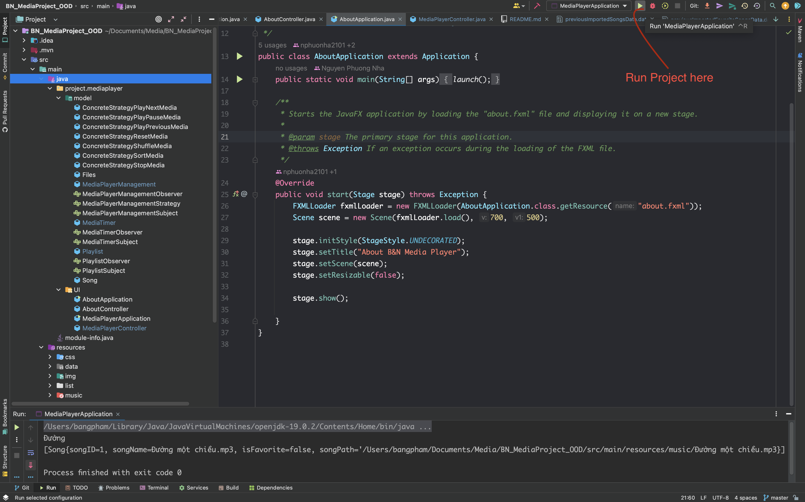
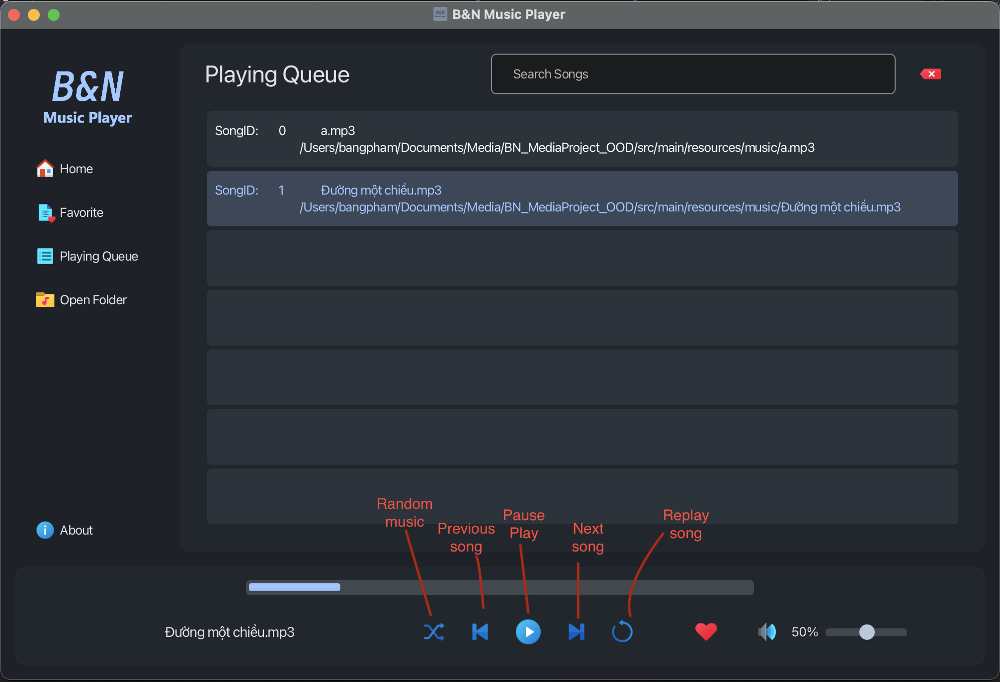
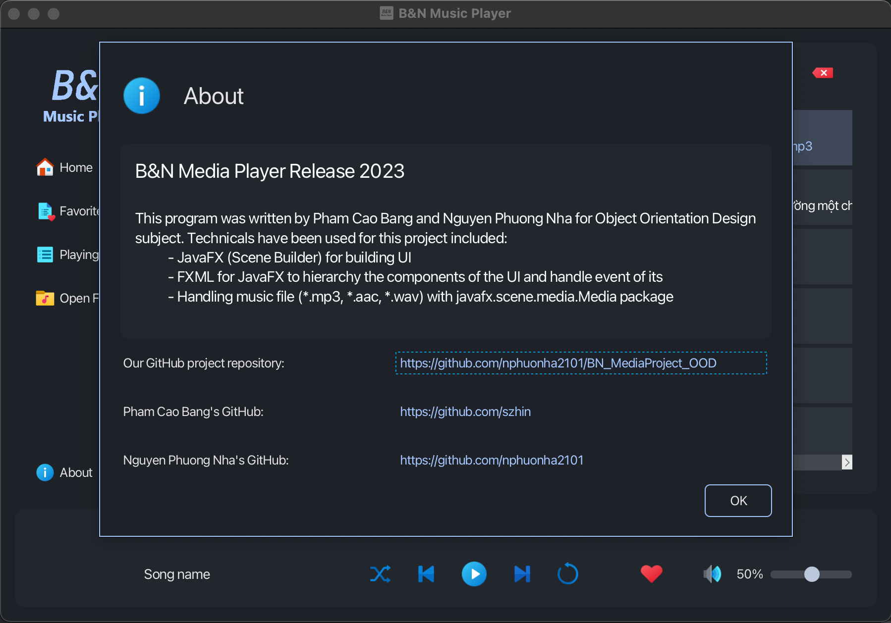
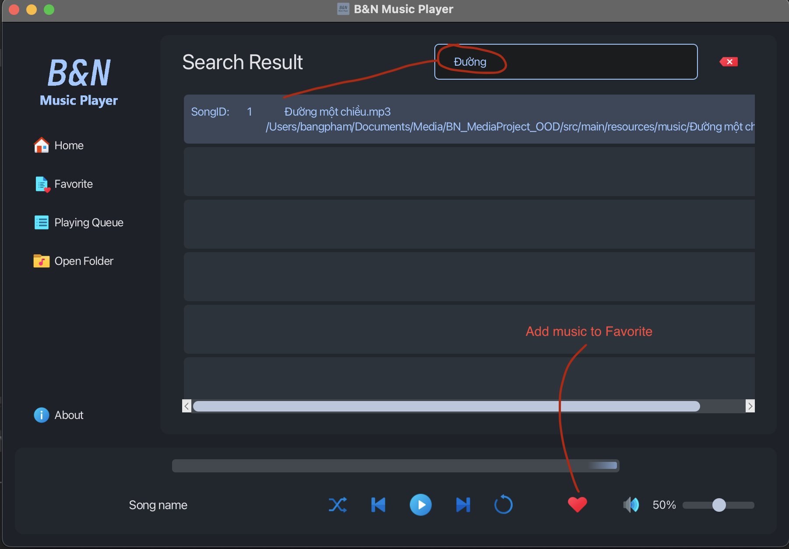
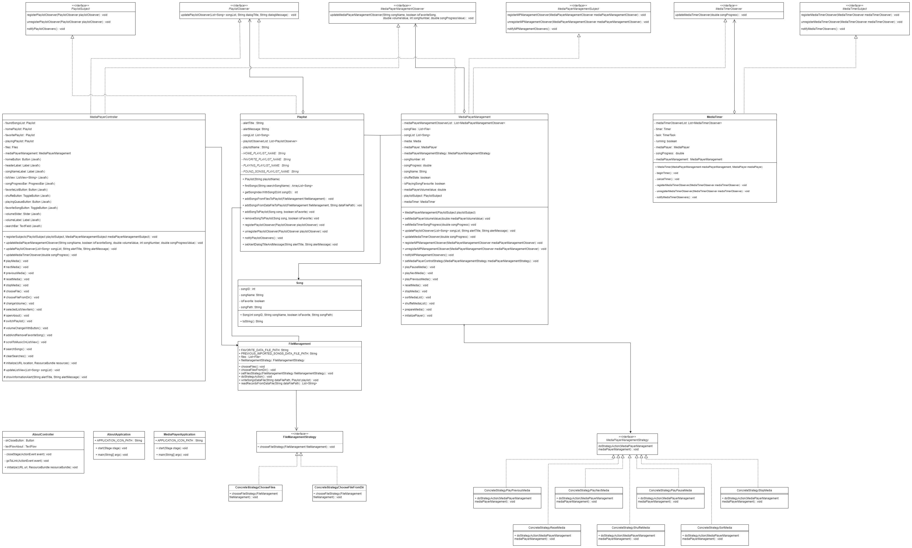

  # B&N Music Player

  B&N Music Player is a Java language music player application created by Nguyen Phuong Nha and Pham Cao Bang. The
  application allows users to play, pause, skip to the next song, previous, reset the current song, and play songs
  randomly. It also includes additional features such as volume control, seeking to a specific position in a song, and the
  ability to search for songs. Users can add songs to their favorite list by clicking the "heart" button.

  ## Table of Contents

  - [Usage](#usage)
  - [Features](#features)
  - [Diagram](#diagram)
  - [Contributors](#contributors)
  - [License](#license)
  - [For you](#for---you)

## Usage

  1. Clone the repository: https://github.com/nphuonha2101/BN_MediaProject_OOD.git

  ```bash
  $ mkdir Media
  $ cd Media
  $ git clone https://github.com/nphuonha2101/BN_MediaProject_OOD.git
  ```
  2. Open the project in your Java IDE.

  ```bash
  $ cd BN_MediaProject_OOD
  $ code .
  ```

  3. Compile and run the application.

You can run this program by running `main` method in `MediaPlayerApplication` class from path `src/main/java/project/mediaplayer/UI/MediaPlayerApplication.java`

  ```java
    public static void main(String[]args){
        launch(args);
    }
  ```

Run project in IDE:



  4. Use the various controls provided to play, pause, skip, reset, and control the volume of the music.

  5. Use the search functionality to find songs and add them to your favorite list.

  ## Features

1. **Play, Pause, Next, Previous, Reset, Random Music**: Users can control the playback of the music, including playing,
   pausing, skipping to the next song, resetting the current song, and playing songs randomly.

   

2. **Volume Control:** Users can adjust the volume of the music.

   

3. **Open folder:** Choose folder have song you like in your computer.

   

4. **Playlist Alert, about alert:** Users are alerted when the playlist does not have any songs, the application
   provides information about the project itself through an "About" alert.

   

5. **Search and Add to Favorite List:** Users can search for songs and add them to their favorite list by clicking the "
   heart" button.

   

## Diagram

This is our general class diagram



## Contributors

- Nguyen Phuong Nha : https://github.com/nphuonha2101
- Pham Cao Bang : https://github.com/szhin

## License

This project is licensed under the MIT License.

## For you

  Hope you enjoy it, thank you so much.
  Have a good day 🥰😋😎
